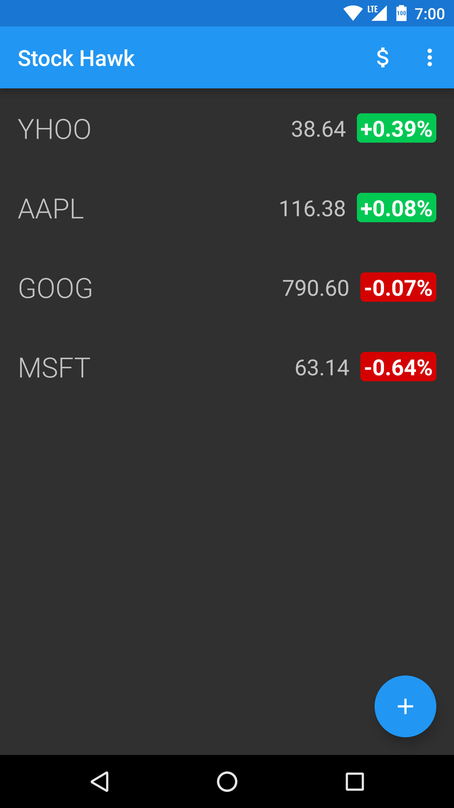
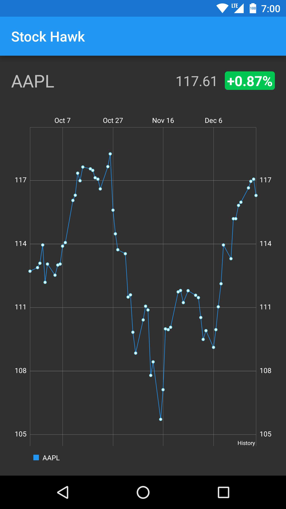
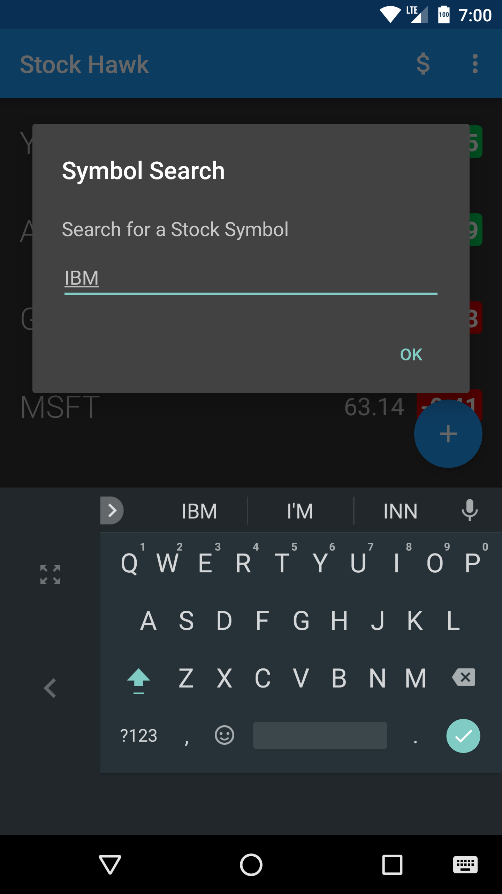

## Description
StockHawk is a simple stock app that I developed as part of the Udacity Android Developer 
Nanodegree. It uses a Yahoo YQL query to fetch stock information and historical data.

## Instructions
There are no special instructions to install this app. Just download, open with Android Studio,
and install to a device.
